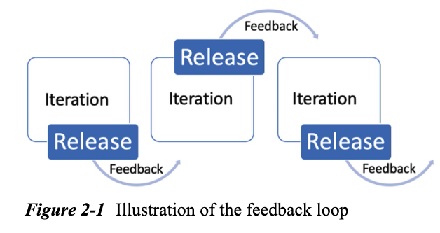
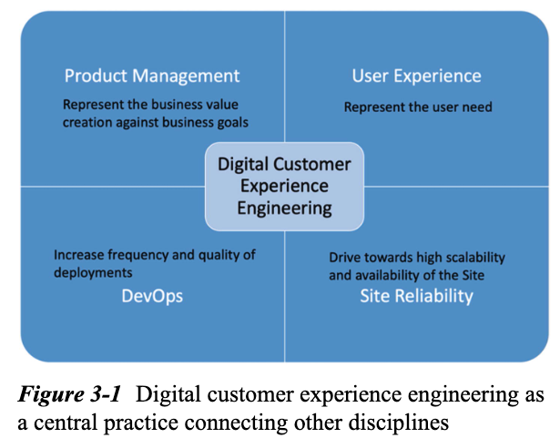
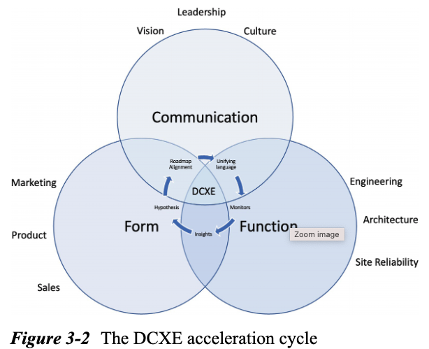
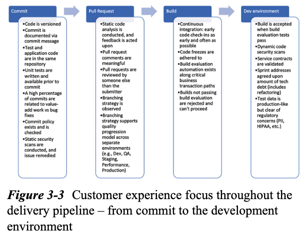
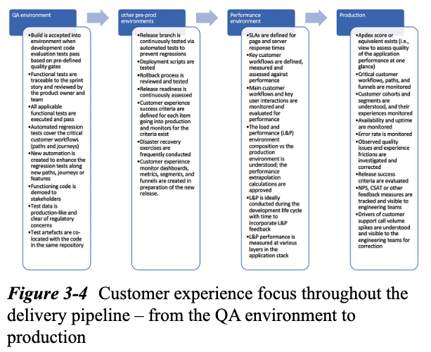
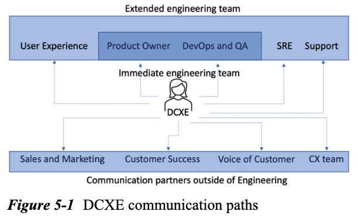
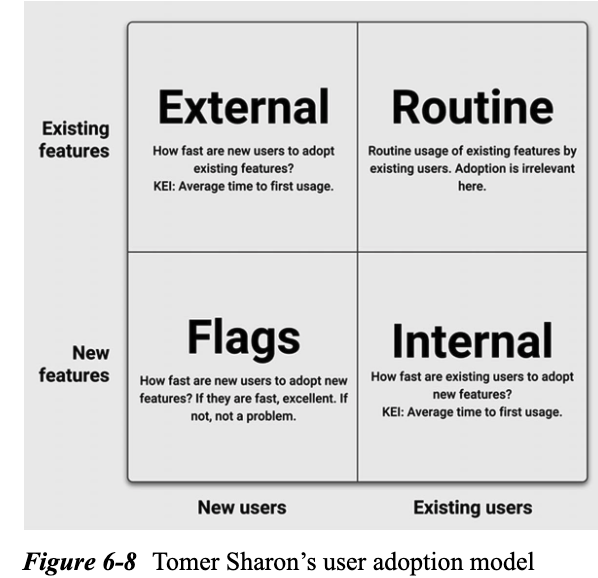
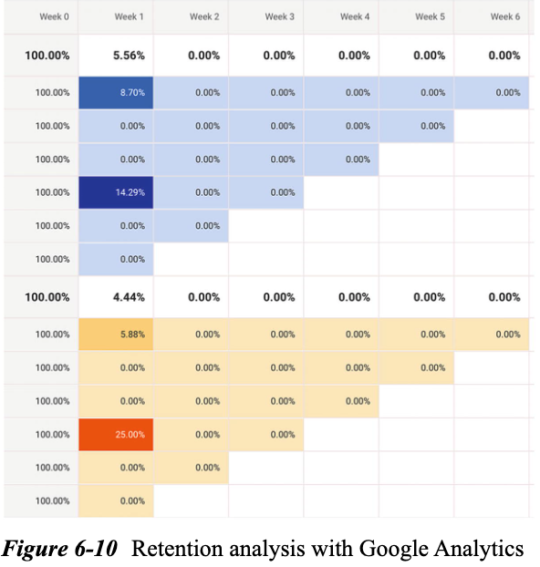

# Digital Customer Experience Engineering

## 1. The importance of acting today(Getting digital experiences right is not optional)
### Top 3 Challenges to Overcome
1. Data silos containing different and unrelated customer data spread across the organization
2. Lack of integration of customer data and listening across a dynamic  omnichanel customer journey
3. Creating an aligned culture of employee empowerment and organizational action to adjust to the dynamic customer journey
## 2. Opportunities(Optimize the structue of the traditional digital engineering feddback loop)
### Insights into the traditional digital software engineering feedback loop

### Direct Form of Feedback:
- Call hotlines
- email to supoort inbox
- live chat
- embeded product reviews and ratings
### Indirect Form of Feedback:
- Social media
- Online forums
### A framework of opportunities making the feedback loop more efficient
- Create observability into the experiences of customers for team members who are no directly involved in the customer experience interacting via support
- Accelerate the recongition of customer sentiment by the engineering and product teams that are typically hidden within the support queues
- Develop an early detection mechanism and framework for customer experience-related friction associated  to software issues
## 3. Digital Customer Experience Engineering(A discipline envisioned)

### Form, Function, and Communication

- Communication: Leadership setup the tone via the organization's culture, vision and mission
- Form: Product, Marketing, and Sales
- Function: Engineering, Architecture, and Site Reliability
### Digital Customer Experience Engineering CI/CD Pipeline Touchpoints

## 4. Goals
### Combining Engineering and Business Goals("shift right" and "shift left")
### What this is - In less than six words
### Guiding Principles
- Digital Customer experience Observability is tangible and essential
- Observability Data needs to be organized to separate "Noise" from "Signal"
- Connecting Other to Insights is the key to success
- Dedication to constant investigation toward friction removal
## 5. Interactions

### Stakeholders Communication
## 6. How-to Guide
### Typical Activities and Responsibilities
- NPS
- Traceability of customer feedback on CRM and Engineering observability tools
#### Customer Experience Observability Program Governance
#### Cross-Team Alignment and Communication
#### Customer Experience Observability and Traceability Tools
#### Customer-Focused Input into the CI/CD Pipeline
- pendo.io
- heap.io
#### Enabling Speeding Up the Analysis of Customer Feedback and Sentiment
- NPS -> Manual Analysis -> AWS Comprehend: Sentiment Analysis from Customer Reviews
- Speed up the analysis of customer feedback received via the support channels(NPS comments, support tickets, etc.)
#### Increasing the signal-to-noise ratio of alerting tolls
- PagerDuty/Sentry: "Cry Wolf" too often -> DCXE reduces the noise
- Collaboration between DCXE and SRE teams: Latency, Errors, Saturation, and Traffic
#### Support Engineering Escalation Analysis
#### Identify and Map to Key User Journeys and Touchpoints
#### Why are customers seeking support?
#### Establish Customer Engagement and Feedback Channels

#### Establish Customer Retention Tracking

## 7. Key Metrics
## 8. Useful Tools
## 9. How to get started(Today: Be curious and empathy with your customers, translate this curiosity into the right mind-a strong belief and certainty that empathy for the customer and their experience can be observed, measured, and improved, and choose the right tools as the last step)
