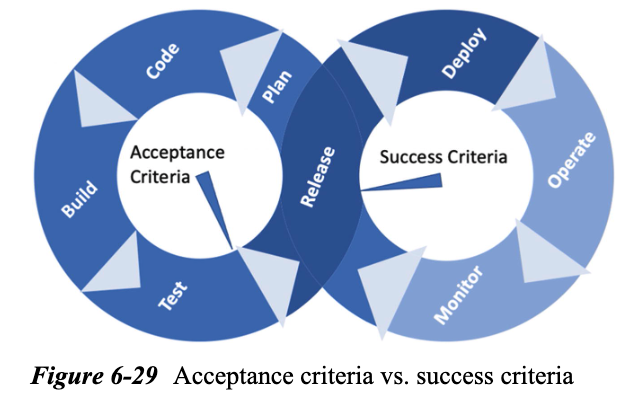
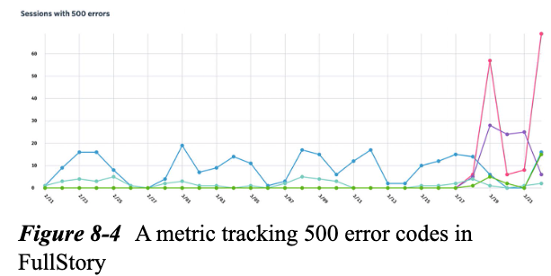

# Digital Customer Experience Engineering
## Strategies for Creating Effective Digital Experiences

## 1. The importance of acting today(Getting digital experiences right is not optional)
### Top 3 Challenges to Overcome
1. Data silos containing different and unrelated customer data spread across the organization
2. Lack of integration of customer data and listening across a dynamic  omnichanel customer journey
3. Creating an aligned culture of employee empowerment and organizational action to adjust to the dynamic customer journey
## 2. Opportunities(Optimize the structue of the traditional digital engineering feddback loop)
### Insights into the traditional digital software engineering feedback loop

### Direct Form of Feedback:
- Call hotlines
- email to supoort inbox
- live chat
- embeded product reviews and ratings
### Indirect Form of Feedback:
- Social media
- Online forums
### A framework of opportunities making the feedback loop more efficient
- Create observability into the experiences of customers for team members who are no directly involved in the customer experience interacting via support
- Accelerate the recongition of customer sentiment by the engineering and product teams that are typically hidden within the support queues
- Develop an early detection mechanism and framework for customer experience-related friction associated  to software issues
## 3. Digital Customer Experience Engineering(A discipline envisioned)

### Form, Function, and Communication

- Communication: Leadership setup the tone via the organization's culture, vision and mission
- Form: Product, Marketing, and Sales
- Function: Engineering, Architecture, and Site Reliability
### Digital Customer Experience Engineering CI/CD Pipeline Touchpoints

## 4. Goals
### Combining Engineering and Business Goals("shift right" and "shift left")
### What this is - In less than six words
### Guiding Principles
- Digital Customer experience Observability is tangible and essential
- Observability Data needs to be organized to separate "Noise" from "Signal"
- Connecting Other to Insights is the key to success
- Dedication to constant investigation toward friction removal
## 5. Interactions

### Stakeholders Communication
## 6. How-to Guide
### Typical Activities and Responsibilities
- NPS
- Traceability of customer feedback on CRM and Engineering observability tools
#### Customer Experience Observability Program Governance
#### Cross-Team Alignment and Communication
#### Customer Experience Observability and Traceability Tools
#### Customer-Focused Input into the CI/CD Pipeline
- pendo.io
- heap.io
#### Enabling Speeding Up the Analysis of Customer Feedback and Sentiment
- NPS -> Manual Analysis -> AWS Comprehend: Sentiment Analysis from Customer Reviews
- Speed up the analysis of customer feedback received via the support channels(NPS comments, support tickets, etc.)
#### Increasing the signal-to-noise ratio of alerting tolls
- PagerDuty/Sentry: "Cry Wolf" too often -> DCXE reduces the noise
- Collaboration between DCXE and SRE teams: Latency, Errors, Saturation, and Traffic
#### Support Engineering Escalation Analysis
#### Identify and Map to Key User Journeys and Touchpoints
#### Why are customers seeking support?
#### Establish Customer Engagement and Feedback Channels

#### Establish Customer Retention Tracking

#### Create a Digital Representation of Customer Journey Success

#### Calibrate Alert - From Noise to Important Customer Impact Signals
#### Speed up RCA(Root Cause Analysis)
- Funnel
- Engagement
- Retention

#### Detect and Remove Customer Friction

#### Make Customer Experience Friction Monitoring Easy with Dashboards
- Fullstory
- LogRocket
- Pendo
- Heap
- Amplitude
- Quantum Metric
- AppDynamics
- New Relic
- Dynatrace
- Tealeaf
- Splunk
#### Seed Your Regression Test with Customer journey Interactions

#### Speed up the ananlysis of customer feedback received via the support channels

#### Implement the Idea of Success Criteria

#### Did the Release Meet the Business Goals?

#### Is the Release Technically and Functionally Sound and Does it Contribute to Site Stability and Availability?
#### Was the Desired User Engagement Achieved Within the Desired Timeframe?

#### Did the Release Receive Positive Customer Feedback?
#### Is the Release Void of Any Discernible User Experience Friction?
- GitHub + Sentry
#### Summary Regarding Success Criteria

### Customer Observability and Privacy Considerations
### Reflect the Customer Experience Insights to Your Customers
### Build the Foundation for Tracking Customer Experience Engineering Metrics

- Jira(DefectManage) + Salesforce(CRM) + Pendo(CustomerExperienceAnalysis) + Fullstory(SessioinReplay) + Sentry(ErrorManage) + DataDog(APM) + GitHub(CodeRepository)
## 7. Key Metrics(For Successful Digital Engineering, Customer Quality, and Observability)
### Top Six Customer Experience Metrics for Engineering Teams to Consider
- NPS(Net Promoter Score)
- CES(Customer Effort Score)
- CSAT(Customer Satisfaction Score)
- CLV(Customer Lifetime Value)
- Retention
- Churn
### Other Customer experience Metrics to Consider
- Apdex Score(Application Performance Index)
- Error Rate
- Uptime
- Number of escalated customer experience issues
- Number of detected customer experience issues
- Time to resolution
- SLA adherence
- Number of site incidents
- Software Security-related metrics
- Number of success criteria validated
## 8. Useful Tools

### Tools focusing on product analytics

- Customer Experience Flow or Journey Analytics: See where the customers are going as they enter the digital experience and where they leave
- Device, platform, and channel analytics: See what devices, platforms, and channels customers are using to access the digital experience
- Segmentation and Cohort Analysis: Discover how cohorts or segments of your customers are behaving, engaging, and experiencing the digital experience.
- Engagement Analysis: Learn which feartures are popular and which are not
- Retention Analysis: See how many customers are returning to the digital experience
### Tools focusing on customer experience visualization at the sessioin level

- Instant Visual Confirmation(a.k.a session replay) of the customer experience in the same form the customer experienced it, with important enhancements like analytics, developer tools, or friction highlighting.
- Heatmaps: See where customers are clicking, scrolling, and moving their mouse
- Search: Search for specific customer sessions.
- Dashboards: Create dashboards to track key metrics and KPIs.
### APM(Applicatioin Performance Management) tools(measuring friction in the engineering stack and speed up RCA)

- Application Monitoring: Monitor the performance of the application and its dependencies.
- Availability and Error Monitoring: Monitor the availability and error rate of the application.
- Database Monitoring: Monitor the performance of the database.
- In-Context Observability of Metrics, Logs, and Traces: See the metrics, logs, and traces of the application in the context of the customer experience.
- Customer Experience and Business Metrics and Analytics: See the customer experience and business metrics and analytics in the context of the application.
## 9. How to get started(Today: Be curious and empathy with your customers, translate this curiosity into the right mind-a strong belief and certainty that empathy for the customer and their experience can be observed, measured, and improved, and choose the right tools as the last step)
### Break it down into smaller steps

### Organizatioinal Needs

