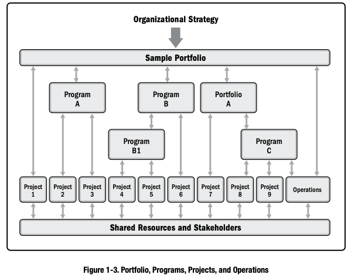
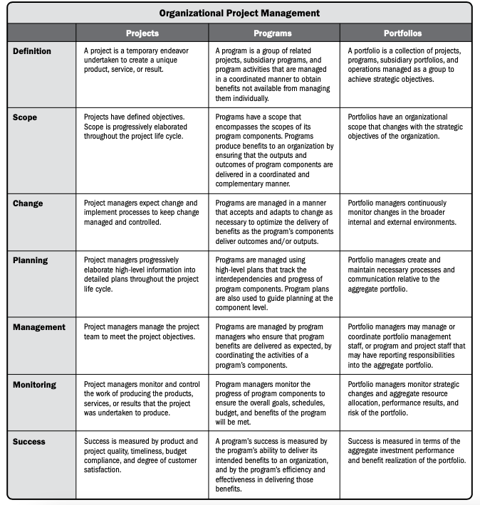
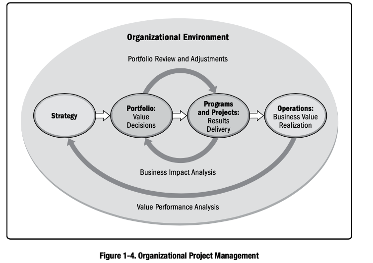
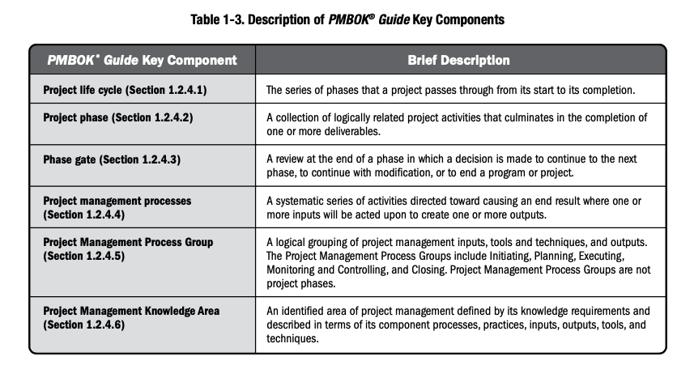
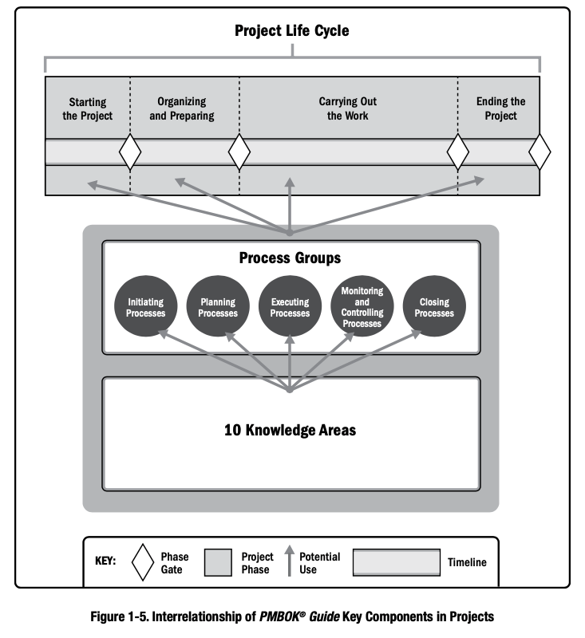
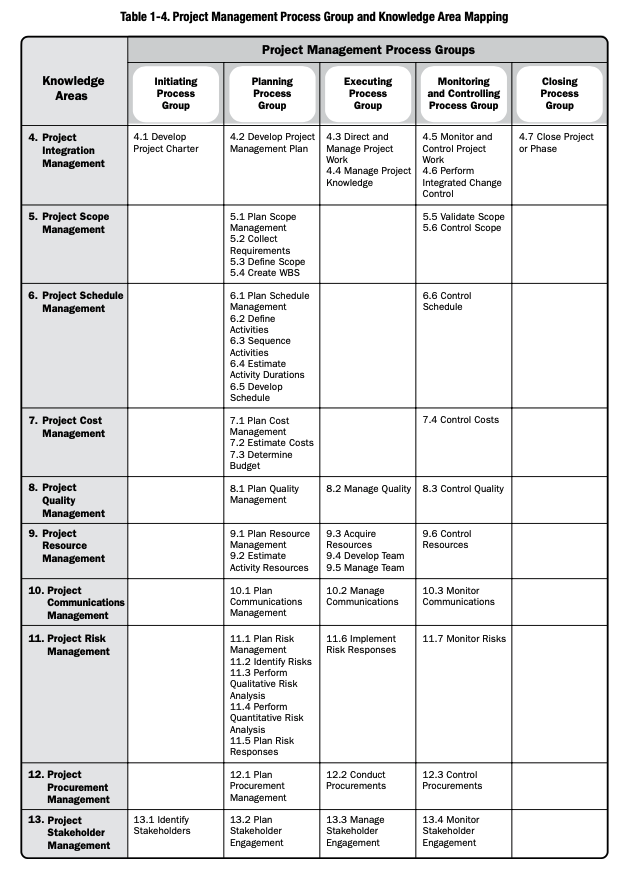
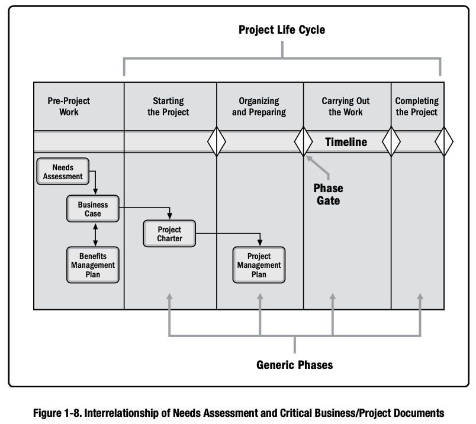
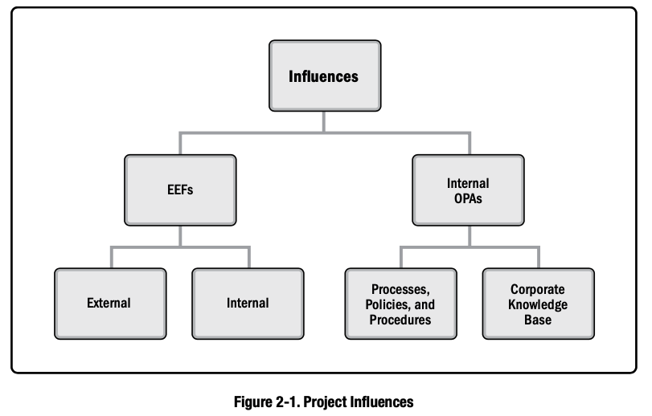

# Part 1. A Guide to the Project Management Body of Knowledge

## 1 Introduction
### 1.1 Overview and Purpose of this Guide
#### 1.1.1 The Standard for Project Management
#### 1.1.2 Common Vocabulary
#### 1.1.3 Code of Ethics and Professional Conduct
### 1.2 Foundational Elements
#### 1.2.1 Projects
A Project is a temporary endeavor undertaken to create a unique product, service, or result.
- Unique product, service, or result
- Temporary endeavor
- Projects drive change  
  
- Projects enable business value creation
- Project Initiation Context  
    
   
#### 1.2.2 The Importance of Project Management
 

#### 1.2.3 Relationship of Project, Program, Portfolio, and Operations Management
 

#### 1.2.4 Components of the Guide

#### 1.2.5 Tailoring
#### 1.2.6 Project Management Business Documents
- Project Business Case: A documented economic feasibility study used to establish the validity of the benefits of a selected component lacking sufficient definition and that is used as a basis for the authorization of further project management activities.
- Project Benefits Management Plan: The documented explanation defining the processes for creating, maximizing, and sustaining the benefits provided by a project.

 

## 2 The Environment in which Project Operate
### 2.1 Overview

### 2.2 Enterprise Environment Factors
#### 2.2.1 EEFs Internal to the Organization
- Organizational Culture, Structure, and Governance
- Geographic Distribution of Facilities and Resources
- Infrastructure
- Information Technology Software
- Resource Available
- Employee Capability
#### 2.2.2 EEFs External to the Organization
- Marketplace Conditions
- Social and Culture Influences and Issues
- Legal Restrictions
- Commercial Database
- Academic Research
- Government or Industry Standards
- Financial Considerations
- Physical Environmental Elements
### 2.3 Organizational Process Assets
#### 2.3.1 Process, Policies, and Procedures
- Initiating and Planning
- Executing, Monitoring and Controlling
- Closing
#### 2.3.2 Organizational Knowledge Repositories
- Configuration Management Knowledge Repositories
- Financial Data Repositories
- Historical Information and Lessons Learned Knowledge Repositories
- Issue and Defect Management Data Repositories
- Data Repositories
- Project Files from previous projects
### 2.4 Organizational Systems
#### 2.4.1 Overview
#### 2.4.2 Organizational Governance Frameworks
#### 2.4.3 Management Elements
#### 2.4.4 Organizational Structure Types
## 3 The Role of the Project Manager
### 3.1 Overview
### 3.2 Definition of a Project Manager
### 3.3 The Project Manager's Sphere of Influence
#### 3.3.1 Overview
#### 3.3.2 The Project
#### 3.3.3 The Organization
#### 3.3.4 The Industry
#### 3.3.5 Professional Discipline
#### 3.3.6 Across Disciplines
### 3.4 Project Manager Competences
#### 3.4.1 Overview
#### 3.4.2 Technical Project Management Skills
#### 3.4.3 Strategic and Business Management Skills
#### 3.4.4 Leadership Skills
#### 3.4.5 Comparison of Leadership and Management
### 3.5 Performing Integration
#### 3.5.1 Performing Integration at the Process Level
#### 3.5.2 Integration at the Cognitive Level
#### 3.5.3 Integration at the Context Level
#### 3.5.4 Integration and Complexity
## 4 Project Integration Management
### 4.1 Develop Project Charter
#### 4.1.1 Develop Project Charter: Inputs
#### 4.1.2 Develop Project Charter: Tools and Techniques
#### 4.1.3 Develop Project Charter: Outputs
### 4.2 Develop Project Management Plan
#### 4.2.1 Develop Project Management Plan: Inputs
#### 4.2.2 Develop Project Management Plan: Tools and Techniques
#### 4.2.3 Develop Project Management Plan: Outputs
### 4.3 Direct and Manage Project Work
#### 4.3.1 Direct and Manage Project Work: Inputs
#### 4.3.2 Direct and Manage Project Work: Tools and Techniques
#### 4.3.3 Direct and Manage Project Work: Outputs
### 4.4 Manage Project Knowledge
#### 4.4.1 Manage Project Knowledge: Inputs
#### 4.4.2 Manage Project Knowledge: Tools and Techniques
#### 4.4.3 Manage Project Knowledge: Outputs
### 4.5 Monitor and Control Project Work
#### 4.5.1 Monitor and Control Project Work: Inputs
#### 4.5.2 Monitor and Control Project Work: Tools and Techniques
#### 4.5.3 Monitor and Control Project Work: Outputs
### 4.6 Perform Integrated Change Control
#### 4.6.1 Perform Integrated Change Control: Inputs
#### 4.6.2 Perform Integrated Change Control: Tools and Techniques
#### 4.6.3 Perform Integrated Change Control: Outputs
### 4.7 Close Project Phase
#### 4.7.1 Close Project Phase: Inputs
#### 4.7.2 Close Project Phase: Tools and Techniques
#### 4.7.3 Close Project Phase: Outputs
## 5 Project Scope Management
### 5.1 Plan Scope Management
#### 5.1.1 Plan Scope Management: Inputs
#### 5.1.2 Plan Scope Management: Tools and Techniques
#### 5.1.3 Plan Scope Management: Outputs
### 5.2 Collect Requirements
#### 5.2.1 Collect Requirements: Inputs
#### 5.2.2 Plan Scope Management: Tools and Techniques
#### 5.2.3 Plan Scope Management: Outputs
### 5.3 Define Scope
#### 5.3.1 Define Scope: Inputs
#### 5.3.2 Define Scope: Tools and Techniques
#### 5.3.3 Define Scope: Outputs
### 5.4 Create WBS
#### 5.4.1 Create WBS: Inputs
#### 5.4.2 Create WBS: Tools and Techniques
#### 5.4.3 Create WBS: Outputs
### 5.5 Validate Scope
#### 5.5.1 Validate Scope: Inputs
#### 5.5.2 Validate Scope: Tools and Techniques
#### 5.5.3 Validate Scope: Outputs
### 5.6 Control Scope
#### 5.6.1 Control Scope: Inputs
#### 5.6.2 Control Scope: Tools and Techniques
#### 5.6.3 Control Scope: Outputs
## 6 Project Schedule Management
### 6.1 Plan Schedule Management
#### 6.1.1 Plan Schedule Management: Inputs
#### 6.1.2 Plan Schedule Management: Tools and Techniques
#### 6.1.3 Plan Schedule Management: Outputs
### 6.2 Define Activities
#### 6.2.1 Define Activities: Inputs
#### 6.2.2 Define Activities: Tools and Techniques
#### 6.2.3 Define Activities: Outputs
### 6.3 Sequence Activities
#### 6.3.1 Sequence Activities: Inputs
#### 6.3.2 Sequence Activities: Tools and Techniques
#### 6.3.3 Sequence Activities: Outputs
### 6.4 Estimate Activity Durations
#### 6.4.1 Estimate Activity Durations: Inputs
#### 6.4.2 Estimate Activity Durations: Tools and Techniques
#### 6.4.3 Estimate Activity Durations: Outputs
### 6.5 Develop Schedule
#### 6.5.1 Develop Schedule: Inputs
#### 6.5.2 Develop Schedule: Tools and Techniques
#### 6.5.3 Develop Schedule: Outputs
### 6.6 Control Schedule
#### 6.6.1 Control Schedule: Inputs
### 6.6.2 Control Schedule: Tools and Techniques
### 6.6.3 Control Schedule: Outputs
## 7 Project Cost Management
### 7.1 Plan Cost Management
#### 7.1.1 Plan Cost Management: Inputs
#### 7.1.2 Plan Cost Management: Tools and Techniques
### 7.1.3 Plan Cost Management: Outputs
### 7.2 Estimate Cost Management
#### 7.2.1 Estimate Cost Management: Inputs
#### 7.2.2 Estimate Cost Management: Tools and Techniques
#### 7.2.3 Estimate Cost Management: Outputs
### 7.3 Determine Cost Management
#### 7.3.1 Determine Cost Management: Inputs
#### 7.3.2 Determine Cost Management: Tools and Techniques
#### 7.3.3 Determine Cost Management: Outputs
### 7.4 Control Costs
#### 7.4.1 Control Costs: Inputs
#### 7.4.2 Control Costs: Tools and Technique
#### 7.4.2 Control Costs: Outputs
## 8 Project Quality Management
### 8.1 Plan Quality Management
#### 8.1.1 Plan Quality Management: Inputs
#### 8.1.2 Plan Quality Management: Tools and Techniques
#### 8.1.3 Plan Quality Management: Outputs
### 8.2 Manage Quality
#### 8.2.1 Manage Quality: Inputs
#### 8.2.2 Plan Quality Management: Tools and Techniques
#### 8.2.3 Plan Quality Management: Outputs
### 8.3 Control Quality
#### 8.3.1 Control Quality: Inputs
#### 8.3.2 Control Quality: Tools and Techniques
#### 8.3.3 Plan Quality Management: Outputs
## 9 Project Resource Management
### 9.1 Plan Resource Management
#### 9.1.1 Plan Resource Management: Inputs
#### 9.1.2 Plan Resource Management: Tools and Techniques
#### 9.1.3 Plan Resource Management: Outputs
### 9.2 Estimate Resource Management
#### 9.2.1 Estimate Resource Management: Inputs
#### 9.2.2 Estimate Resource Management: Tools and Techniques
#### 9.2.3 Estimate Resource Management: Outputs
### 9.3 Acquire Resources
#### 9.3.1 Acquire Resources: Inputs
#### 9.3.2 Acquire Resources: Tools and Techniques
#### 9.3.3 Estimate Resource Management: Outputs
### 9.4 Develop Team
#### 9.4.1 Develop Team: Inputs
#### 9.4.2 Develop Team: Tools and Techniques
#### 9.4.3 Develop Team: Outputs
### 9.5 Manage Team
#### 9.5.1 Manage Team: Inputs
#### 9.5.2 Manage Team: Tools and Techniques
#### 9.5.3 Manage Team: Outputs
### 9.6 Control Resources
#### 9.6.1 Control Resources: Inputs
#### 9.6.2 Control Resources: Tools and Techniques
#### 9.6.3 Control Resources: Outputs
## 10 Project Communication Management
### 10.1 Plan Communication Management
#### 10.1.1 Plan Communication Management: Inputs
#### 10.1.2 Plan Communication Management: Tools and Techniques
#### 10.1.3 Plan Communication Management: Outputs
### 10.2 Manage Communications
#### 10.2.1 Manage Communications: Inputs
#### 10.2.2 Plan Communications: Tools and Techniques
#### 10.2.3 Plan Communications: Outputs
### 10.3 Monitor Communications
#### 10.3.1 Monitor Communication: Inputs
#### 10.3.2 Monitor Communication: Tools and Techniques
#### 10.3.3 Plan Communication: Outputs
## 11 Project Risk Management
### 11.1 Plan Risk Management
#### 11.1.1 Plan Risk Management: Inputs
#### 11.1.2 Plan Risk Management: Tools and Techniques
#### 11.1.3 Plan Risk Management: Outputs
### 11.2 Identity Risks
#### 11.2.1 Identity Risks: Inputs
#### 11.2.2 Identity Risks: Tools and Techniques
#### 11.2.3 Identity Risks: Outputs
### 11.3 Perform Qualitative Risk Analysis
#### 11.3.1 Perform Qualitative Risk Analysis: Inputs
#### 11.3.2 Perform Qualitative Risk Analysis: Tools and Techniques
#### 11.3.3 Perform Qualitative Risk Analysis: Outputs
### 11.4 Perform Quantitative Risk Analysis
#### 11.4.1 Perform Quantitative Risk Analysis: Inputs
#### 11.4.2 Perform Quantitative Risk Analysis: Tools and Techniques
#### 11.4.3 Perform Quantitative Risk Analysis: Outputs
### 11.5 Plan Risk Responses
#### 11.5.1 Plan Risk Responses: Inputs
#### 11.5.2 Plan Risk Responses: Tools and Techniques
#### 11.5.3 Plan Risk Responses: Outputs
### 11.6 Implement Risk Responses
#### 11.6.1 Implement Risk Responses: Inputs
#### 11.6.2 Implement Risk Responses: Tools and Techniques
#### 11.6.3 Implement Risk Responses: Outputs
### 11.7 Monitor Risks
#### 11.7.1 Monitor Risks: Inputs
#### 11.7.2 Monitor Risks: Tools and Techniques
#### 11.7.3 Monitor Risks: Outputs
## 12 Project Procurement Management
### 12.1 Plan Procurement Management
#### 12.1.1 Plan Procurement Management: Inputs
#### 12.1.2 Plan Procurement Management: Tools and Techniques
#### 12.1.3 Plan Procurement Management: Outputs
### 12.2 Conduct Procurements
#### 12.2.1 Conduct Procurements: Inputs
#### 12.2.2 Plan Procurement Management: Tools and Techniques
#### 12.2.3 Plan Procurement Management: Outputs
### 12.3 Control Procurements
#### 12.3.1 Control Procurements: Inputs
#### 12.3.2 Plan Procurement Management: Tools and Techniques
#### 12.3.3 Plan Procurement Management: Outputs
## 13 Project Stakeholder Management
### 13.1 Identify Stakeholders
#### 13.1.1 Identify Stakeholders: Inputs
#### 13.1.2 Identify Stakeholders: Tools and Techniques
#### 13.1.3 Identify Stakeholders: Outputs
### 13.2 Plan Stakeholder Engagement
#### 13.2.1 Plan Stakeholder Engagement: Inputs
#### 13.2.2 Identify Stakeholders: Tools and Techniques
#### 13.2.3 Identify Stakeholders: Outputs
### 13.3 Manage Stakeholder Engagement
#### 13.3.1 Manage Stakeholder Engagement: Inputs
#### 13.3.2 Manage Stakeholder Engagement: Tools and Techniques
#### 13.3.3 Manage Stakeholder Engagement: Outputs
### 13.4 Monitor Stakeholder Engagement
#### 13.4.1 Monitor Stakeholder Engagement: Inputs
#### 13.4.2 Monitor Stakeholder Engagement: Tools and Techniques
#### 13.4.3 Monitor Stakeholder Engagement: Outputs
 

# Part 2. The Standard for Project Management

## 1 Introduction
### 1.1 Projects and Project Management
### 1.2 Relationships Among Portfolios, Programs and Projects
### 1.3 Linking Organizational Governance and Project Governance
### 1.4 Project Success and Benefits Management
### 1.5 The Project Life Cycle
### 1.6 Project Stakeholders
### 1.7 Role of the Project Manager
### 1.8 Project Management Knowledge Areas
### 1.9 Project Management Process Groups
### 1.10 Enterprise Environmental Factors and Organizational Process Assets
### 1.11 Tailoring the Project Artifacts
## 2 Initialing Process Group
### 2.1 Develop Project Charter
### 2.2 Identify Stakeholders
#### 2.2.1 Project Management Plan Components
#### 2.2.2 Project Documents Examples
#### 2.2.3 Project Management Plan Updates
#### 2.2.4 Project Documents Updates
## 3 Planning Process Group
### 3.1 Develop Project Plan
### 3.2 Plan Scope Management
#### 3.2.1 Project Management Plan Components
### 3.3 Collect Requirements
#### 3.3.1 Project Management Plan Components
#### 3.3.2 Project Documents Examples
### 3.4 Define Scope
#### 3.4.1 Project Management Plan Components
#### 3.4.2 Project Documents Examples
#### 3.4.3 Project Documents Updates
### 3.5 Create WBS
#### 3.5.1 Project Management Plan Components
#### 3.5.2 Project Documents Examples
#### 3.5.3 Project Documents Updates
### 3.6 Plan Schedule Management
#### 3.6.1 Project Management Plan Components
### 3.7 Define Activities
#### 3.7.1 Project Management Plan Components
#### 3.7.2 Project Documents Examples
### 3.8 Sequence Activities
#### 3.8.1 Project Management Plan Components
#### 3.8.2 Project Documents Examples
#### 3.8.3 Project Documents Updates
### 3.9 Estimate Activity Duration
#### 3.9.1 Project Management Plan Components
#### 3.9.2 Project Documents Examples
#### 3.9.3 Project Documents Updates
### 3.10 Develop Schedule
#### 3.10.1 Project Management Plan Components
#### 3.10.2 Project Documents Examples
#### 3.10.3 Project Documents Plan Updates
#### 3.10.4 Project Documents Updates
### 3.11 Plan Cost Management
#### 3.11.1 Project Management Plan Components
### 3.12 Estimate Costs
### 3.13 Determine Budget
### 3.14 Plan Quality Management
### 3.15 Plan Resource Management
### 3.16 Estimate Activity Resources
### 3.17 Plan Communications Management
### 3.18 Plan Risk Management
### 3.19 Identify Risks
### 3.20 Perform Qualitative Risk Analysis
### 3.21 Perform Quantitative Risk Analysis
### 3.22 Plan Risk Responses
### 3.23 Plan Procurement Management
### 3.24 Plan Stakeholders Engagement
## 4 Executing Project Management
### 4.1 Direct and Manage Project Work
### 4.2 Manage Project Knowledge
### 4.3 Manage Quality
### 4.4 Acquire Resources
### 4.5 Develop Team
### 4.6 Manage Team
### 4.7 Manage Communications
### 4.8 Implement Risk Response
### 4.9 Conduct Procurements
### 4.10 Manage Stakeholders Engagement
## 5 Monitoring and Controlling Process Group
### 5.1 Monitor and Control Project Work
### 5.2 Perform Integrated Change Control
### 5.3 Validate Scope
### 5.4 Control Scope
### 5.5 Control Schedule
### 5.6 Control Costs
### 5.7 Control Quality
### 5.8 Control Resources
### 5.9 Monitor Communications
### 5.10 Monitor Risks
### 5.11 Control Procurements
### 5.12 Monitor Stakeholder Engagement
## 6 Closing Process Group
### 6.1 Close Project or Phase